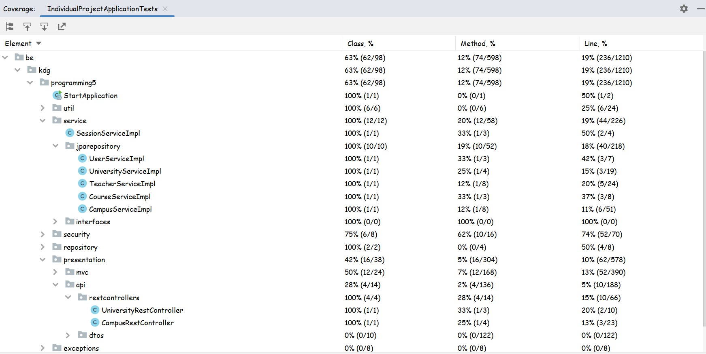

# Universitaria
## Silviu Dobre  
###
###
### Introduction
> My domain is used to make an educational platform.
> The used entities are:
> - University
> - Campus
> - Teacher
> - Course
> - User(account)
>> The relations are:
>> - A **teacher** has many **courses** (one to many)
>> - A **campus** hosts many **courses** (many to one)
>> - A **university** is made of many **campuses** (one to many)
>> - A **teacher** can have one **user account** (one to one)
>
> The project uses H2 database for development and PostgreSQL database for production.
>
> PostgreSQL database setup from dockerfile
>> From the project root, create the docker image using the present 'Dockerfile':
>>> ```shell
>>> docker build -t "universitaria_db_image:Dockerfile" .
>>> ```
>>
>> Create a container from the image using port 5435
>>> ```shell
>>> docker create --name universitaria_db_container -p 5435:5432 universitaria_db_image:Dockerfile
>>> ```
>>
>>Start the container:
>>> ```shell
>>> docker container start universitaria_db_container
>>> ```
>>
> Build/run gradle commands:
>> Execute all tests and checks:
>>> ```shell
>>> ./gradlew check
>>> ```
>>
>> Build and run the application:
>>> ```shell
>>> ./gradlew bootrun
>>> ```
>>
>


### Week 1

> #### GET METHOD - searchuniversity page -> type: GET ALL WHICH HAVE ...
>
>> 1. request for status 200 - OK
>>> ```
>>> GET http://localhost:8082/api/universities?searchValue=ka HTTP/1.1
>>> Accept: application/json
>>> ```
>>>
>>> the response:
>>>> ```
>>>> HTTP/1.1 200
>>>> Content-Type: application/json
>>>> Transfer-Encoding: chunked
>>>> Date: Wed, 08 Mar 2023 21:46:30 GMT
>>>> Keep-Alive: timeout=60
>>>> Connection: keep-alive
>>>>
>>>> [
>>>>   {
>>>>     "name": "Karel de Grote",
>>>>     "foundingDate": "1995-09-01",
>>>>     "universityType": "Hogeschool"
>>>>   },
>>>>   {
>>>>     "name": "Karel de Kleine",
>>>>     "foundingDate": "1995-09-01",
>>>>     "universityType": "Hogeschool"
>>>>   }
>>>> ]
>>>> ```
>>>
>>
>> 2. request for status 204 - NO CONTENT
>>> ```
>>> GET http://localhost:8082/api/universities?searchValue=kat HTTP/1.1
>>> Accept: application/json
>>> ```
>>>
>>> the response:
>>>> ```
>>>> HTTP/1.1 404
>>>> Content-Length: 0
>>>> Date: Wed, 08 Mar 2023 21:36:11 GMT
>>>> Keep-Alive: timeout=60
>>>> Connection: keep-alive
>>>> ```
>>>
>>
>
> #### DELETE METHOD - campuses page -> type: DELETE 1
> NOTE: consider that campus with id=1 exists before the requests
>
>> 1. request for status 204 - NO CONTENT
>>> ```
>>> DELETE http://localhost:8082/api/campuses/1 HTTP/1.1
>>> ```
>>>
>>> the response:
>>>> ```
>>>> HTTP/1.1 204
>>>> Date: Wed, 08 Mar 2023 21:50:09 GMT
>>>> Keep-Alive: timeout=60
>>>> Connection: keep-alive
>>>> ```
>>>
>>
>> 2. request for status 404 - NOT FOUND
>>> ```
>>> DELETE http://localhost:8082/api/campuses/1 HTTP/1.1
>>> ```
>>>
>>> the response:
>>>> ```
>>>> HTTP/1.1 404
>>>> Content-Length: 0
>>>> Date: Wed, 08 Mar 2023 21:51:13 GMT
>>>> Keep-Alive: timeout=60
>>>> Connection: keep-alive
>>>> ```
>>>
>>
>


### Week 2

> #### POST METHOD - addcampus page
> 
>> 1. request for status 201 - OK
>>> ```
>>> POST http://localhost:8082/api/campuses HTTP/1.1
>>> Accept: application/json
>>> Content-Type: application/json
>>> 
>>> {"universityName":"Karel de Grote","name":"Bernanduscentrum","address":"somewhere in groenplaats 32","postalCode":"2311","city":"Antwerpen","openingTime":"08:00","closingTime":"22:00"}
>>> ``` 
>>> 
>>> the response:
>>>> ```
>>>> HTTP/1.1 201
>>>> Content-Type: application/json
>>>> Transfer-Encoding: chunked
>>>> Date: Mon, 20 Mar 2023 03:31:09 GMT
>>>> Keep-Alive: timeout=60
>>>> Connection: keep-alive
>>>> 
>>>> {
>>>> "campusId": 9,
>>>> "universityName": "Karel de Grote",
>>>> "name": "Bernanduscentrum",
>>>> "address": "somewhere in groenplaats 32",
>>>> "postalCode": 2311,
>>>> "city": "Antwerpen",
>>>> "openingTime": "08:00:00",
>>>> "closingTime": "22:00:00"
>>>> }
>>>> ```
>>>
>> 2. request for status 400 - BAD REQUEST
>>> ```
>>> POST http://localhost:8082/api/campuses HTTP/1.1
>>> Accept: application/json
>>> Content-Type: application/json
>>> 
>>> {"universityName":"Karel de Oude","name":"Bernanduscentrum","address":"somewhere in groenplaats 32","postalCode":"2311","city":"Antwerpen","openingTime":"08:00","closingTime":"22:00"}
>>> ```
>>>  the response:
>>>> ``` 
>>>> HTTP/1.1 400
>>>> Content-Length: 0
>>>> Date: Mon, 20 Mar 2023 03:49:03 GMT
>>>> Connection: close
>>>> ```
>>>
>> 
> #### (MERGE) PATCH METHOD - campuses page => Update 1
> 
>>  1. request for status 204 - NO CONTENT
>>> ``` 
>>> PATCH http://localhost:8082/api/campuses/1 HTTP/1.1
>>> Accept: application/json
>>> Content-Type: application/json
>>> 
>>> {"name":"Bernanduscentrum","closingTime":"12:00"}
>>> ``` 
>>>  the response:
>>>> ``` 
>>>> HTTP/1.1 204
>>>> Date: Mon, 20 Mar 2023 04:03:30 GMT
>>>> Keep-Alive: timeout=60
>>>> Connection: keep-alive
>>>> ```
>>>
>> 2.request for status 400 - BAD REQUEST
>>> ``` 
>>> PATCH http://localhost:8082/api/campuses/1 HTTP/1.1
>>> Accept: application/json
>>> Content-Type: application/json
>>> 
>>> {"name":"Bernanduscentrum","closingTime":"1200"}
>>> ```
>>> the response:
>>>> ```
>>>> HTTP/1.1 400
>>>> Content-Type: application/json
>>>> Transfer-Encoding: chunked
>>>> Date: Mon, 20 Mar 2023 04:05:21 GMT
>>>> Connection: close
>>>> 
>>>> {
>>>>   "timestamp": "2023-03-20T04:05:21.158+00:00",
>>>>   "status": 400,
>>>>   "error": "Bad Request",
>>>>   "path": "/api/campuses/1"
>>>> }
>>>> ```
>>> 
>> 3. request for status 404 - NOT FOUND
>>> ``` 
>>> PATCH http://localhost:8082/api/campuses/99999999 HTTP/1.1
>>> Accept: application/json
>>> Content-Type: application/json
>>> 
>>> {"name":"Bernanduscentrum","closingTime":"12:00"}
>>> ``` 
>>> the response:
>>>>  ``` 
>>>> HTTP/1.1 404
>>>> Content-Length: 0
>>>> Date: Mon, 20 Mar 2023 04:07:16 GMT
>>>> Keep-Alive: timeout=60
>>>> Connection: keep-alive
>>>> ```
>>>
>>

> #### CONTENT NEGOTIATION - universities
> 
>> 1. request which accepts only JSON
>>> ```
>>> GET http://localhost:8082/api/universities/Karel de Kleine HTTP/1.1
>>> Accept: application/json
>>> ``` 
>> 2. request which accepts only XML
>>> ```
>>> GET http://localhost:8082/api/universities/Karel de Kleine HTTP/1.1
>>> Accept: application/xml
>>> ```
>>
>


### Week 3 + 4

> #### USER ACCOUNTS
>
>> 1. 'Role_Admin' account:
>>> ```
>>> username: admin
>>> password: admin
>>> ```
>> 2. 'Role_Teacher' accounts
>>> ```
>>> username:
>>>> lars.willemsens
>>>> jan.derijke
>>>> wim.dekeyser
>>>> ann.gielis
>>>> hans.vochten
>>>> lisa.coucke
>>>> sam.ketels
>>>> jan.velaers
>>>> christine.vandenwyngaert
>>>> maarten.larmuseau
>>>> anita.evenepoel
>>>> edwig.abrath
>>> password (for all): 1234
>>> ```
>> 3. 'Role_User' account:
>>> ```
>>> username: user
>>> password: user
>>> ```
>>
>
> #### VISIBILITY:
> - UNAUTHENTICATED
> - AUTHENTICATED with account 'Role_User'
> - AUTHENTICATED with account 'Role_Teacher'
> - AUTHENTICATED with account 'Role_Admin'
>
>> 1. UNAUTHENTICATED
>>> CAN see/do:
>>>> - see home page ('/index')
>>>> - see login page ('/login')
>>>> - login with an account
>>>> - change language - English or Romanian
>>> CANNOT see/do:
>>>> - see teachers page ('/teacher')
>>>> - see campuses page ('/campuses')
>>>> - see info about a specific teacher ('/ateacher')
>>>> - see info about a specific campus ('/acampus')
>>>> - see searchuniversities page ('/searchuniversity')
>>>> - see job locations ('/myjoblocations')
>>>> - see addteacher page ('/addteacher')
>>>> - see addcampus page ('/addcampus')
>>>> - do any CRUD operation on campuses/teachers/universities/teacherxcampus/users
>>>> - see their sessionhistory ('/sessionhistory')
>>>
>> 2. AUTHENTICATED with account 'Role_User'
>>> same* visibility as UNAUTHENTICATED user, excepting that they also CAN see/do:
>>>> - see searchuniversities page ('/searchuniversity')
>>>> - search for universities (READ functionality)
>>>> - see their sessionhistory ('/sessionhistory')
>>>
>> 3. AUTHENTICATED with account 'Role_Teacher'
>>> same* visibility as AUTHENTICATED with account 'Role_User', excepting that they also CAN see/do:
>>>> - see their job locations
>>>> - see the courses they teach in a certain location
>>>
>> 4. AUTHENTICATED with account 'Role_Admin'
>>> same* visibility as AUTHENTICATED with account 'Role_User', excepting that they also CAN see/do:
>>>> - see teachers page ('/teacher')
>>>> - see campuses page ('/campuses')
>>>> - see info about a specific teacher ('/ateacher')
>>>> - see info about a specific campus ('/acampus')
>>>> - see addteacher page ('/addteacher')
>>>> - see addcampus page ('/addcampus')
>>>> - do any CRUD operation on campuses/teachers/universities/courses
>>>> - automatically erase user accounts with 'Role_Teacher' when the corresponding Teacher is deleted
>>>
>> *: excluding that they CANNOT login again (of course); implicitly, they CAN now logout
>


### Week 7

> #### TEST COVERAGE
>
>> 
>
> #### TEST CLASSES
>
>> 1. Mocking tests:
>>> ```
>>> - CampusRestControllerUnitTest
>>> - TeacherServiceImplUnitTest
>>> ```
>> 2. 'verify' tests:
>>> ```
>>> - TeacherServiceImplUnitTest
>>> ```
>> 3. Role verification tests:
>>> ```
>>> - UniversityRestControllerTest
>>> - CampusRestControllerTest
>>> - CampusRestControllerUnitTest
>>> ```
>>
>


### Week 9

> #### CLIENT-SIDE VALIDATION using Joi validator
>
>> implemented in form 'Add Campus'
>>> ```
>>> individual-project/src/main/js/addcampus.js
>>> http://localhost:8082/addcampus
>>> ```
>>
>
> #### (additional) JavaScript dependencies
>
>> flatpickr
>>> ```
>>> individual-project/src/main/js/addcampus.js
>>> addcampus page: http://localhost:8082/addcampus
>>> ```
>> 
>

### Week 11

> #### ASYNCHRONOUS FILE UPLOAD
>
>> implemented in form 'Upload universities'
>>> ```
>>> test file: individual-project/src/main/resources/csv/universities.csv
>>> http://localhost:8082/universities_csv
>>> ```
>>
>
